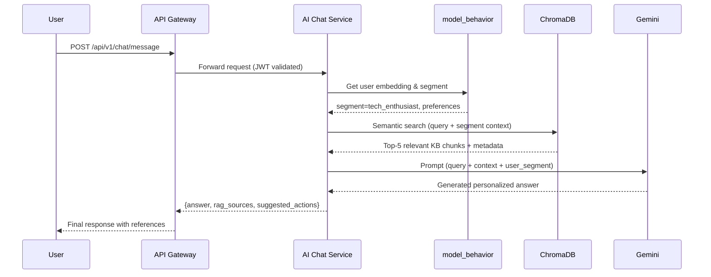

# trình bày chi tiết quá trình thiết kế, xây dựng và tích hợp hệ thống AI tư vấn khách hàng dựa trên phân tích hành vi vào hệ thống Laptop Shop theo kiến trúc microservice.

## 1. Xây dựng Mô hình model_behavior dựa trên Deep Learning
### 1.1. Thu thập và Tiền xử lý Dữ liệu
Dữ liệu hành vi khách hàng được thu thập từ hệ thống Laptop Shop bao gồm các sự kiện: xem sản phẩm, tìm kiếm, thêm vào giỏ hàng, mua hàng, và tương tác với chatbot. Dữ liệu được lưu trữ trong PostgreSQL và xử lý thông qua pipeline ETL.
Schema dữ liệu hành vi được thiết kế như sau:

```python 
# models.py - User Behavior Model
class UserBehaviorEvent(models.Model):
    user_id      = models.UUIDField(db_index=True)
    session_id   = models.UUIDField()
    event_type   = models.CharField(max_length=50)  # view, search, cart, purchase
    product_id   = models.UUIDField(null=True)
    category     = models.CharField(max_length=100, null=True)
    search_query = models.TextField(null=True)
    duration_ms  = models.IntegerField(default=0)
    metadata     = models.JSONField(default=dict)
    created_at   = models.DateTimeField(auto_now_add=True)

    class Meta:
        db_table = 'user_behavior_events'
        indexes  = [models.Index(fields=['user_id', 'created_at'])]
```
### 1.2 Kiến trúc Mô hình Deep Learning
Mô hình model_behavior được xây dựng dựa trên kiến trúc Transformer với cơ chế Self-Attention để nắm bắt các mối quan hệ phức tạp trong chuỗi hành vi của người dùng. Mô hình có khả năng học được các pattern mua sắm theo ngữ cảnh thời gian.

```python
# model_behavior.py
import torch
import torch.nn as nn

class BehaviorTransformer(nn.Module):
    def __init__(self, num_items, num_categories, embed_dim=128, num_heads=8, num_layers=4):
        super().__init__()
        self.item_embedding    = nn.Embedding(num_items + 1, embed_dim, padding_idx=0)
        self.cat_embedding     = nn.Embedding(num_categories + 1, embed_dim // 4)
        self.event_embedding   = nn.Embedding(6, embed_dim // 4)  # 6 event types
        self.positional_enc    = nn.Embedding(200, embed_dim)
        encoder_layer          = nn.TransformerEncoderLayer(
            d_model=embed_dim, nhead=num_heads, dim_feedforward=512, dropout=0.1
        )
        self.transformer       = nn.TransformerEncoder(encoder_layer, num_layers=num_layers)
        self.output_layer      = nn.Linear(embed_dim, num_items)

    def forward(self, item_seq, cat_seq, event_seq, positions):
        x = self.item_embedding(item_seq)
        x = x + self.positional_enc(positions)
        x = self.transformer(x.permute(1, 0, 2)).permute(1, 0, 2)
        return self.output_layer(x[:, -1, :])  # Predict next interaction

```

### 1.3 Huấn luyện Mô hình
huấn luyện trên google colab với gpu

```python
training code
```
### 1.4 Customer Segmentation
Dựa trên vector embedding từ mô hình, khách hàng được phân cụm thành các nhóm có đặc điểm hành vi tương đồng bằng thuật toán K-Means với k=6 cụm:
•	Nhóm 1 – High-Value Buyers: Mua hàng thường xuyên, giá trị đơn hàng cao, ưu tiên laptop gaming/workstation
•	Nhóm 2 – Bargain Hunters: Nhạy cảm với giá, thường chờ khuyến mãi, ưu tiên tầm trung
•	Nhóm 3 – Brand Loyalists: Luôn tìm kiếm một thương hiệu cụ thể (Apple, Dell, Lenovo)
•	Nhóm 4 – Tech Enthusiasts: Xem nhiều sản phẩm, đọc kỹ thông số, so sánh nhiều
•	Nhóm 5 – Occasional Shoppers: Mua theo mùa hoặc dịp đặc biệt
•	Nhóm 6 – New Users: Ít lịch sử, cần định hướng và tư vấn nhiều hơn

## 2. Xây dựng Knowledge Base cho chatbot tư vấn
### 2.1 Cấu trúc và Nội dung Knowledge Base
Knowledge Base được xây dựng để lưu trữ toàn bộ thông tin cần thiết cho việc tư vấn sản phẩm laptop, bao gồm thông tin sản phẩm, so sánh dòng máy, hướng dẫn lựa chọn theo nhu cầu sử dụng, chính sách bảo hành, và thông tin kỹ thuật chi tiết.

Cấu trúc thư mục KB được tổ chức như sau:

```
knowledge_base/
├── products/
│   ├── gaming/        # Dell Alienware, ASUS ROG, Lenovo Legion...
│   ├── ultrabook/     # MacBook Air, LG Gram, Dell XPS...
│   ├── workstation/   # MacBook Pro M3, ThinkPad X1 Carbon...
│   └── budget/        # Acer Aspire, HP 15s, Lenovo IdeaPad...
├── guides/
│   ├── choose_by_usage.md   # Hướng dẫn chọn theo nhu cầu
│   ├── specs_explained.md   # Giải thích thông số kỹ thuật
│   └── comparison_tips.md   # Mẹo so sánh laptop
├── policies/
│   ├── warranty.md          # Chính sách bảo hành
│   ├── return.md            # Chính sách đổi trả
│   └── payment.md          # Phương thức thanh toán
└── faq/
    ├── technical_faq.md    # FAQ kỹ thuật
    └── purchase_faq.md    # FAQ mua hàng

```

### 2.2 Quy trình Vector hóa và Indexing
Toàn bộ tài liệu trong KB được chuyển đổi thành vector embeddings sử dụng mô hình multilingual-e5-large (hỗ trợ tiếng Việt) và lưu vào vector database ChromaDB. Quá trình indexing được thực hiện theo các bước:

```python
# kb_indexer.py
from langchain.text_splitter import RecursiveCharacterTextSplitter
from langchain_community.vectorstores import Chroma
from langchain_community.embeddings import HuggingFaceEmbeddings

def index_knowledge_base(kb_dir: str):
    # Load all documents
    documents = load_documents(kb_dir)          #20 documents total
    
    # Split into chunks (512 tokens, 50 overlap)
    splitter = RecursiveCharacterTextSplitter(
        chunk_size=512, chunk_overlap=50,
        separators=['\n\n', '\n', '. ', ', ', '']
    )
    chunks = splitter.split_documents(documents)  
    
    # Embed with multilingual model
    embeddings = HuggingFaceEmbeddings(
        model_name='intfloat/multilingual-e5-large',
        model_kwargs={'device': 'cuda'}
    )
    
    # Store in ChromaDB
    vectorstore = Chroma.from_documents(
        documents=chunks, embedding=embeddings,
        persist_directory='./chroma_db',
        collection_name='laptop_shop_kb'
    )
    return vectorstore
```

## 2.3 Áp dụng RAG để Xây dựng Chat Tư vấn
### 2.3.1 Kiến trúc RAG Pipeline
Hệ thống RAG (Retrieval-Augmented Generation) được thiết kế để kết hợp tri thức từ Knowledge Base với khả năng sinh ngôn ngữ tự nhiên của LLM, đồng thời tích hợp thông tin phân tích hành vi từ mô hình model_behavior để cá nhân hóa tư vấn.



### 2.3.2 Triển khai RAG Service
RAG Service được xây dựng như một microservice độc lập sử dụng Django framework, có trách nhiệm nhận câu hỏi từ người dùng, truy vấn KB, cá nhân hóa context từ model_behavior, và gọi LLM để sinh câu trả lời:

### 2.3.3 Ví dụ API Call và Response với RAG
Dưới đây là ví dụ minh họa luồng gọi API tư vấn chatbot từ frontend/client và phản hồi có tham chiếu tài liệu từ Knowledge Base (RAG):
Request – Khách hàng hỏi về laptop gaming trong tầm giá 25 triệu:

```json
POST /api/v1/chat/message
Content-Type: application/json

{
  "user_id"     : "US_001",
  "message"     : "tư vấn cho tôi laptop gaming tầm 25 triệu,
                    chủ yếu chơi game và stream, RAM ít nhất 16GB",
  "context"     : {
    "page"       : "product_listing",
    "category"   : "gaming_laptop",
    "filters"    : { "price_max": 25000000 }
  }
}
```

Response – Chatbot trả về câu trả lời có tham chiếu đến tài liệu KB:

```json
HTTP/1.1 200 OK
Content-Type: application/json

{
  "answer"        : "Với ngân sách 25 triệu và nhu cầu chơi game + stream,
                      tôi gợi ý 3 lựa chọn phù hợp nhất:\n\n
                      1. **ASUS ROG Strix G16 (2024)** – 24.990.000đ\n
                         • Intel i7-13650HX, RTX 4060 8GB, RAM 16GB DDR5\n
                         • Màn hình 165Hz, tản nhiệt xuất sắc cho streaming\n
                      2. **Lenovo Legion 5i Gen 8** – 23.490.000đ\n
                         • Intel i7-13700H, RTX 4060, RAM 16GB, SSD 512GB\n
                         • Pin tốt hơn ROG, phù hợp dùng ngoài\n
                      3. **MSI Katana 15 B13VFK** – 22.990.000đ\n
                         • i7-13620H, RTX 4060, RAM 16GB – Giá tốt nhất nhóm\n\n
                      Bạn ưu tiên hiệu năng tuyệt đối hay pin và di động?",
  "user_segment"  : "tech_enthusiast",
  "rag_sources"   : [
    {
      "document_id"  : "kb_gaming_asus_rog_g16_2024",
      "title"        : "ASUS ROG Strix G16 (2024) – Thông số & Đánh giá",
      "file_path"    : "knowledge_base/products/gaming/asus_rog_g16_2024.md",
      "relevance"    : 0.94,
      "chunk_excerpt": "RTX 4060 8GB GDDR6, TGP 140W, màn hình 165Hz IPS..."
    },
    {
      "document_id"  : "kb_gaming_lenovo_legion5i_gen8",
      "title"        : "Lenovo Legion 5i Gen 8 – Review Chi tiết",
      "file_path"    : "knowledge_base/products/gaming/lenovo_legion5i_gen8.md",
      "relevance"    : 0.91,
      "chunk_excerpt": "Legion 5i Gen 8 nổi bật với hệ tản nhiệt Coldfront 5.0..."
    },
    {
      "document_id"  : "kb_guide_gaming_streaming",
      "title"        : "Hướng dẫn chọn laptop Gaming + Streaming",
      "file_path"    : "knowledge_base/guides/gaming_streaming_guide.md",
      "relevance"    : 0.88,
      "chunk_excerpt": "Để stream ổn định cần CPU mạnh, ít nhất 16GB RAM DDR5..."
    }
  ],
  "behavior_insights": {
    "viewed_categories" : ["gaming", "ultrabook"],
    "price_sensitivity" : "medium",
    "brand_preference"  : ["ASUS", "Lenovo"],
    "session_duration"  : 1842
  },
  "suggested_actions" : [
    { "type": "view_product",   "product_id": "prod_asus_rog_g16_2024"     },
    { "type": "compare",        "products":  ["asus_rog_g16", "legion_5i"] },
    { "type": "apply_filter",   "filter":    "price_max:25000000"          }
  ],
  "processing_time_ms": 842
}

```
## 2.4 cài đặt và triển khai service chatbot tư vấn
- Service chatbot tư vấn được triển khai trên port 8006, có endpoint chính là `/api/v1/chat/message` để nhận câu hỏi từ người dùng và trả về câu trả lời được cá nhân hóa dựa trên RAG.
- Service này sẽ tích hợp với model_behavior để lấy thông tin phân tích hành vi khách hàng và với ChromaDB để truy vấn kiến thức từ KB, đồng thời gọi LLM (Gemini) để sinh câu trả lời.
- tạo dockerfile với base image slim và cấu hình docker compose để chạy cùng các service khác trong hệ thống Laptop Shop.
- Giao diện chatbot trên frontend là widget floating, có thể mở rộng thành 1 khung chat, cho phép khách hàng tương tác trực tiếp để được tư vấn sản phẩm phù hợp nhất dựa trên nhu cầu và hành vi của họ.


