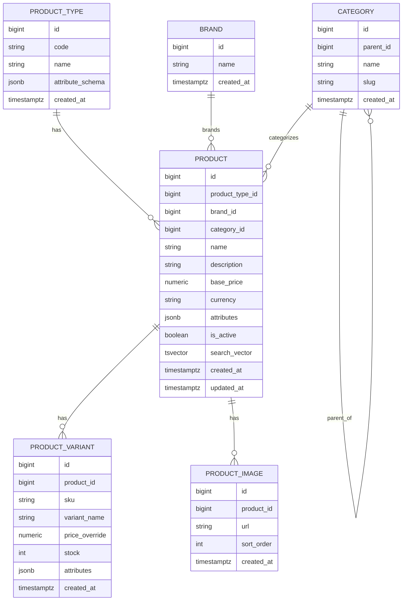

# Entity & DB Design (Product Service: Laptop + Clothes)

## 1. Mục tiêu thiết kế
Thiết kế theo hướng **1 product service quản lý nhiều `product_type`**:
- `product_type`: quyết định **schema attributes** và rule nghiệp vụ (Laptop vs Clothes).
- `category`: quyết định **nhóm trưng bày/điều hướng/filter** (cây danh mục), không quyết định schema.
- `attributes` (JSONB): chứa thuộc tính khác nhau theo từng `product_type`.
- `variant`: SKU cụ thể (đặc biệt quan trọng với Clothes: size/color; với Laptop: có/không tùy sản phẩm).

## 2. Entities (chứa gì)

### 2.1 `ProductType`
Mục tiêu: định nghĩa các loại sản phẩm (Laptop, Clothes) và schema attributes.
- `id`
- `code` (vd: `LAPTOP`, `CLOTHES`) (unique)
- `name` (vd: `Laptop`, `Quần áo`)
- `attribute_schema` (JSONB): JSON Schema mô tả keys hợp lệ cho `Product.attributes` và `Variant.attributes`
- `created_at`

### 2.2 `Brand`
Mục tiêu: nhãn hàng/hãng để filter và hiển thị.
- `id`
- `name` (unique)
- `created_at`

### 2.3 `Category` (tree)
Mục tiêu: cây danh mục để browse/filter.
- `id`
- `parent_id` (nullable, self-FK)
- `name`
- `slug` (unique)
- `created_at`

### 2.4 `Product` (core)
Mục tiêu: thông tin chung cho mọi loại sản phẩm.
- `id`
- `product_type_id` (FK)
- `brand_id` (FK)
- `category_id` (FK)
- `name`
- `description`
- `base_price` + `currency`
- `attributes` (JSONB): spec theo `product_type`
- `is_active`
- `search_vector` (TSVECTOR): phục vụ full-text search
- `created_at`, `updated_at`

### 2.5 `ProductVariant`
Mục tiêu: SKU cụ thể (size/color/option), có stock riêng và có thể override giá.
- `id`
- `product_id` (FK)
- `sku` (unique)
- `variant_name` (vd: `M / Đen`, `16GB/512GB`)
- `price_override` (nullable)
- `stock`
- `attributes` (JSONB): thuộc tính ở mức variant
- `created_at`

### 2.6 `ProductImage`
Mục tiêu: 1 product có nhiều ảnh.
- `id`
- `product_id` (FK)
- `url`
- `sort_order`
- `created_at`

## 3. Attributes theo từng `product_type`

### 3.1 Laptop (Product.attributes)
Tên thuộc tính là **tiếng Anh** (snake_case), ví dụ value **tiếng Việt**.

Gợi ý keys cho Laptop:
- `processor`
- `gpu_model`
- `ram`
- `storage`
- `screen_size_inch`
- `screen_material` (vd: IPS)
- `screen_resolution`
- `screen_technologies` (list)
- `sound`
- `size_cm` (3 chiều)
- `weight_kg`
- `battery`
- `webcam`
- `os`
- `keyboard_backlight`
- `fingerprint_security`
- `ports`
- `connectivity`
- `release_date`

Ví dụ `Product.attributes` cho Laptop:
```json
{
  "processor": "Apple M2 (8 nhân CPU)",
  "gpu_model": "GPU 10 nhân",
  "ram": "16GB thống nhất",
  "storage": "512GB SSD",
  "screen_size_inch": 13.6,
  "screen_material": "IPS",
  "screen_resolution": "2560 x 1664 pixels",
  "screen_technologies": [
    "Độ sáng 500 nit",
    "1 tỷ màu",
    "True Tone"
  ],
  "sound": "4 loa, Dolby Atmos, Spatial Sound",
  "size_cm": {
    "length": 30.41,
    "width": 21.5,
    "height": 1.13
  },
  "weight_kg": 1.24,
  "battery": "Pin dùng cả ngày, sạc USB-C",
  "webcam": "Camera FaceTime HD 1080p",
  "os": "macOS",
  "keyboard_backlight": true,
  "fingerprint_security": "Bảo mật vân tay Touch ID",
  "ports": ["2 x USB-C", "Jack 3.5mm"],
  "connectivity": ["Wi‑Fi 6", "Bluetooth 5.3"],
  "release_date": "2024-10-01"
}
```

Laptop (Variant.attributes) — dùng khi 1 model có nhiều cấu hình:
```json
{
  "ram": "8GB",
  "storage": "256GB SSD",
  "color": "Xám không gian"
}
```

### 3.2 Clothes
Clothes (Product.attributes): mô tả dòng sản phẩm.
- `material`
- `fit`
- `gender`
- `style`
- `care_instructions`
- `purpose`

Ví dụ:
```json
{
  "material": "100% cotton",
  "fit": "form regular",
  "gender": "nam",
  "style": "áo polo",
  "care_instructions": "Giặt máy nước lạnh, không tẩy",
  "purpose": "thể thao, hàng ngày, công sở"
}
```

Clothes (Variant.attributes): lựa chọn mua.
- `size`
- `color`

Ví dụ:
```json
{
  "size": "M",
  "color": "Đen"
}
```

## 4. Attribute schema (JSON Schema)
`ProductType.attribute_schema` có thể lưu JSON Schema (draft 2020-12) để mô tả keys hợp lệ.

> Ghi chú: đây là schema định hướng (dùng để validate ở application layer). DB vẫn lưu JSONB.

### 4.1 Schema cho Laptop
```json
{
  "$schema": "https://json-schema.org/draft/2020-12/schema",
  "$id": "product-type/laptop",
  "title": "Laptop attributes",
  "type": "object",
  "additionalProperties": true,
  "properties": {
    "processor": { "type": "string" },

    "gpu_model": { "type": "string" },

    "ram": { "type": "string" },
    "storage": { "type": "string" },

    "screen_size_inch": { "type": "number" },
    "screen_material": { "type": "string" },
    "screen_resolution": { "type": "string" },
    "screen_technologies": {
      "type": "array",
      "items": { "type": "string" }
    },

    "sound": { "type": "string" },

    "size_cm": {
      "type": "object",
      "additionalProperties": false,
      "properties": {
        "length": { "type": "number" },
        "width": { "type": "number" },
        "height": { "type": "number" }
      },
      "required": ["length", "width", "height"]
    },

    "weight_kg": { "type": "number" },
    "battery": { "type": "string" },

    "webcam": { "type": "string" },
    "os": { "type": "string" },
    "keyboard_backlight": { "type": "boolean" },
    "fingerprint_security": { "type": "string" },

    "ports": { "type": "array", "items": { "type": "string" } },
    "connectivity": { "type": "array", "items": { "type": "string" } },

    "release_date": { "type": "string", "format": "date" }
  },
  "required": [
    "processor",
    "ram",
    "storage",
    "screen_size_inch",
    "screen_resolution"
  ]
}
```

Laptop variant schema (tuỳ chọn):
```json
{
  "$schema": "https://json-schema.org/draft/2020-12/schema",
  "$id": "product-type/laptop-variant",
  "title": "Laptop variant attributes",
  "type": "object",
  "additionalProperties": true,
  "properties": {
    "ram": { "type": "string" },
    "storage": { "type": "string" },
    "color": { "type": "string" }
  }
}
```

### 4.2 Schema cho Clothes
```json
{
  "$schema": "https://json-schema.org/draft/2020-12/schema",
  "$id": "product-type/clothes",
  "title": "Clothes attributes",
  "type": "object",
  "additionalProperties": true,
  "properties": {
    "material": { "type": "string" },
    "fit": { "type": "string" },
    "gender": { "type": "string" },
    "style": { "type": "string" },
    "care_instructions": { "type": "string" },
    "purpose": { "type": "string" }
  },
  "required": ["material", "style"]
}
```

Clothes variant schema:
```json
{
  "$schema": "https://json-schema.org/draft/2020-12/schema",
  "$id": "product-type/clothes-variant",
  "title": "Clothes variant attributes",
  "type": "object",
  "additionalProperties": false,
  "properties": {
    "size": { "type": "string" },
    "color": { "type": "string" }
  },
  "required": ["size", "color"]
}
```

## 5. DB schema (PostgreSQL)

### 5.1 Tables
- `product_types`
- `brands`
- `categories`
- `products`
- `product_variants`
- `product_images`

### 5.2 Physical schema (DDL gợi ý)
```sql
CREATE TABLE product_types (
  id BIGSERIAL PRIMARY KEY,
  code VARCHAR(50) NOT NULL UNIQUE,
  name VARCHAR(255) NOT NULL,
  attribute_schema JSONB NOT NULL DEFAULT '{}'::jsonb,
  created_at TIMESTAMPTZ NOT NULL DEFAULT NOW()
);

CREATE TABLE brands (
  id BIGSERIAL PRIMARY KEY,
  name VARCHAR(255) NOT NULL UNIQUE,
  created_at TIMESTAMPTZ NOT NULL DEFAULT NOW()
);

CREATE TABLE categories (
  id BIGSERIAL PRIMARY KEY,
  parent_id BIGINT NULL REFERENCES categories(id) ON DELETE SET NULL,
  name VARCHAR(255) NOT NULL,
  slug VARCHAR(255) NOT NULL UNIQUE,
  created_at TIMESTAMPTZ NOT NULL DEFAULT NOW()
);

CREATE TABLE products (
  id BIGSERIAL PRIMARY KEY,
  product_type_id BIGINT NOT NULL REFERENCES product_types(id),
  brand_id BIGINT NOT NULL REFERENCES brands(id),
  category_id BIGINT NOT NULL REFERENCES categories(id),
  name VARCHAR(255) NOT NULL,
  description TEXT NOT NULL,
  base_price NUMERIC(12,2) NOT NULL,
  currency VARCHAR(10) NOT NULL DEFAULT 'USD',
  attributes JSONB NOT NULL DEFAULT '{}'::jsonb,
  is_active BOOLEAN NOT NULL DEFAULT TRUE,
  search_vector TSVECTOR,
  created_at TIMESTAMPTZ NOT NULL DEFAULT NOW(),
  updated_at TIMESTAMPTZ NOT NULL DEFAULT NOW()
);

CREATE TABLE product_variants (
  id BIGSERIAL PRIMARY KEY,
  product_id BIGINT NOT NULL REFERENCES products(id) ON DELETE CASCADE,
  sku VARCHAR(100) NOT NULL UNIQUE,
  variant_name VARCHAR(255) NOT NULL,
  price_override NUMERIC(12,2) NULL,
  stock INTEGER NOT NULL DEFAULT 0,
  attributes JSONB NOT NULL DEFAULT '{}'::jsonb,
  created_at TIMESTAMPTZ NOT NULL DEFAULT NOW()
);

CREATE TABLE product_images (
  id BIGSERIAL PRIMARY KEY,
  product_id BIGINT NOT NULL REFERENCES products(id) ON DELETE CASCADE,
  url TEXT NOT NULL,
  sort_order INTEGER NOT NULL DEFAULT 0,
  created_at TIMESTAMPTZ NOT NULL DEFAULT NOW()
);

CREATE INDEX products_attributes_gin ON products USING GIN (attributes);
CREATE INDEX product_variants_attributes_gin ON product_variants USING GIN (attributes);
```

## 6. ERD (Mermaid)


## 7. API endpoints (thiết kế REST)

### 7.1 Base
- Base path: `/api/v1`
- Content-Type: `application/json`

### 7.2 Public endpoints (cho UI/gateway)

#### List/Search products
`GET /api/v1/products`

Query params (tuỳ chọn):
- `q`: text search (full-text + substring tuỳ implementation)
- `product_type`: `LAPTOP` | `CLOTHES`
- `category_id`: filter theo category
- `brand_id`: filter theo brand
- `min_price`, `max_price`
- `in_stock`: `true|false`
- `sort`: `newest|price_asc|price_desc|name_asc|name_desc`
- `page`, `page_size`

Response: `ProductListResponse`

#### Product detail
`GET /api/v1/products/{product_id}`

Response: `ProductDetailResponse` (bao gồm `attributes`, `images`, `variants`)

#### Categories
`GET /api/v1/categories`
- Query params: `tree=true|false` (nếu `tree=true` trả dạng cây)
Response: `CategoryListResponse`

`GET /api/v1/categories/{category_id}`
Response: `CategoryDetailResponse`

#### Brands
`GET /api/v1/brands`
Response: `BrandListResponse`

#### Product types + schema
`GET /api/v1/product-types`
Response: `ProductTypeListResponse` (bao gồm `attribute_schema`)

`GET /api/v1/product-types/{code}`
Response: `ProductTypeDetailResponse`

### 7.3 Inter-service endpoints (Cart/Order dùng)

#### Lookup items (validate id + lấy snapshot giá/stock)
Cart/Order cần endpoint để:
- kiểm tra `product_id`/`variant_id` có tồn tại không
- lấy `unit_price` hiệu lực (variant override nếu có)
- lấy `available_stock` để validate

`POST /api/v1/products/lookup`

Request: `ProductLookupRequest`
Response: `ProductLookupResponse`

Gợi ý dùng trong workflow:
- Cart lưu `product_id` (+ `variant_id` nếu có) và quantity
- Khi xem cart/checkout: Cart gọi `POST /products/lookup` để lấy lại tên/giá/tồn kho (tránh stale data)
- Order gọi lại endpoint này trước khi tạo order/charge

#### Reserve stock (tuỳ chọn nếu làm chặt)
Nếu bạn muốn chặt chẽ về tồn kho (đặt chỗ trước khi thanh toán), thêm 2 endpoint:
- `POST /api/v1/inventory/reservations` (create reservation)
- `POST /api/v1/inventory/reservations/{reservation_id}/commit` (trừ kho)
- `POST /api/v1/inventory/reservations/{reservation_id}/cancel`

> Nếu bài của bạn chưa yêu cầu tồn kho chặt, có thể bỏ phần reservation để đơn giản.

## 8. DTO (request/response)

### 8.1 Common DTO

#### ErrorResponse
```json
{
  "code": "VALIDATION_ERROR",
  "message": "Invalid request",
  "details": {
    "field": "reason"
  }
}
```

#### Pagination
```json
{
  "page": 1,
  "page_size": 12,
  "total": 120,
  "total_pages": 10
}
```

### 8.2 Product list/detail DTO

#### ProductListItem
```json
{
  "id": 123,
  "name": "MacBook Air 13",
  "product_type": { "code": "LAPTOP", "name": "Laptop" },
  "brand": { "id": 1, "name": "Apple" },
  "category": { "id": 10, "name": "Laptops" },
  "price": { "amount": "999.99", "currency": "USD" },
  "in_stock": true,
  "thumbnail_url": "https://...",
  "created_at": "2026-04-14T10:00:00Z"
}
```

#### ProductListResponse
```json
{
  "items": [/* ProductListItem */],
  "pagination": { "page": 1, "page_size": 12, "total": 120, "total_pages": 10 }
}
```

#### ProductVariantDTO
```json
{
  "id": 555,
  "sku": "LAPTOP-123-16-512-SIL",
  "variant_name": "16GB / 512GB / Bạc",
  "price_override": { "amount": "1099.99", "currency": "USD" },
  "stock": 12,
  "attributes": {
    "ram": "16GB",
    "storage": "512GB SSD",
    "color": "Bạc"
  }
}
```

#### ProductImageDTO
```json
{
  "id": 901,
  "url": "https://...",
  "sort_order": 0
}
```

#### ProductDetailResponse
```json
{
  "id": 123,
  "name": "MacBook Air 13",
  "description": "...",
  "product_type": { "code": "LAPTOP", "name": "Laptop" },
  "brand": { "id": 1, "name": "Apple" },
  "category": { "id": 10, "name": "Laptops" },
  "base_price": { "amount": "999.99", "currency": "USD" },
  "attributes": {
    "processor": "Apple M2 (8 nhân CPU)",
    "gpu_model": "GPU 10 nhân",
    "screen_resolution": "2560 x 1664 pixels"
  },
  "images": [/* ProductImageDTO */],
  "variants": [/* ProductVariantDTO */],
  "created_at": "2026-04-14T10:00:00Z",
  "updated_at": "2026-04-14T10:00:00Z"
}
```

> `attributes` phải phù hợp schema trong `product_type.attribute_schema` (Laptop/Clothes). Keys tiếng Anh, giá trị có thể là tiếng Việt.

### 8.3 Category/Brand/ProductType DTO

#### CategoryDTO
```json
{
  "id": 10,
  "parent_id": null,
  "name": "Electronics",
  "slug": "electronics"
}
```

#### CategoryTreeDTO
```json
{
  "id": 10,
  "name": "Electronics",
  "slug": "electronics",
  "children": [
    { "id": 11, "name": "Laptops", "slug": "laptops", "children": [] }
  ]
}
```

#### BrandDTO
```json
{ "id": 1, "name": "Apple" }
```

#### ProductTypeDTO
```json
{
  "id": 1,
  "code": "LAPTOP",
  "name": "Laptop",
  "attribute_schema": { "title": "Laptop attributes" }
}
```

### 8.4 Lookup DTO (Cart/Order)

#### ProductLookupRequest
```json
{
  "items": [
    { "product_id": 123, "variant_id": 555, "quantity": 2 },
    { "product_id": 124, "variant_id": null, "quantity": 1 }
  ]
}
```

#### ProductLookupItemResult
```json
{
  "product_id": 123,
  "variant_id": 555,
  "ok": true,
  "name": "MacBook Air 13",
  "sku": "LAPTOP-123-16-512-SIL",
  "unit_price": { "amount": "1099.99", "currency": "USD" },
  "available_stock": 12,
  "product_type": "LAPTOP"
}
```

#### ProductLookupResponse
```json
{
  "items": [/* ProductLookupItemResult */]
}
```
